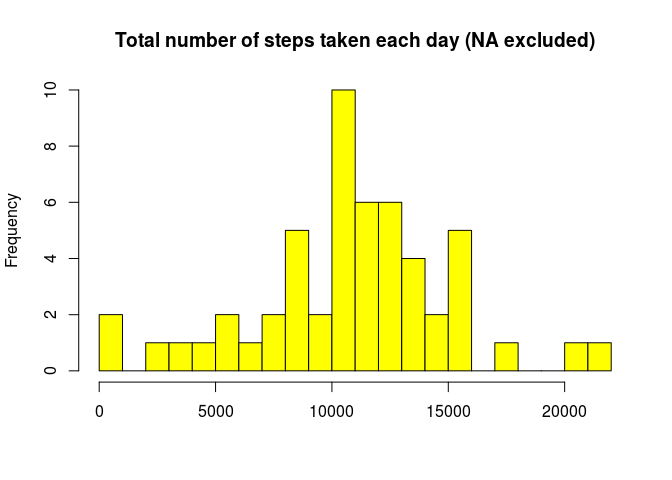
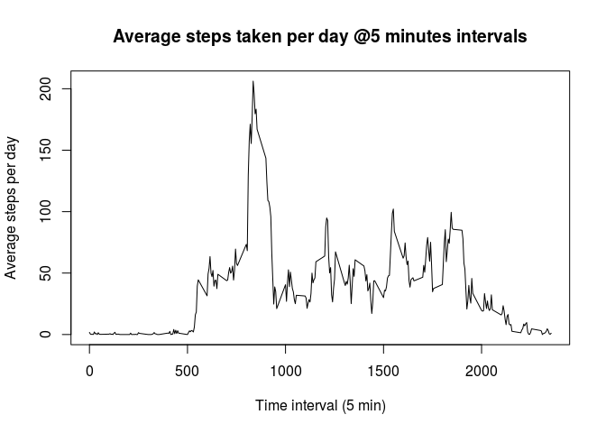
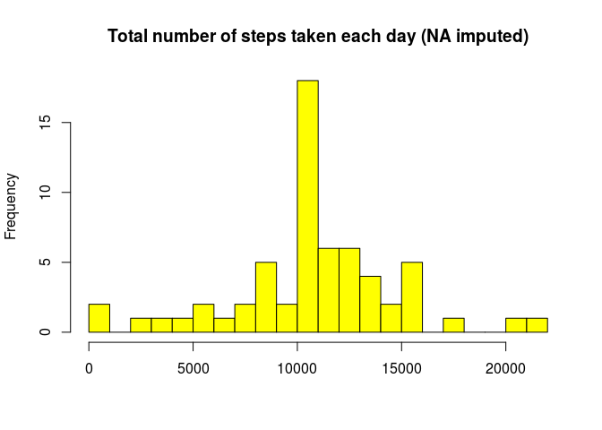
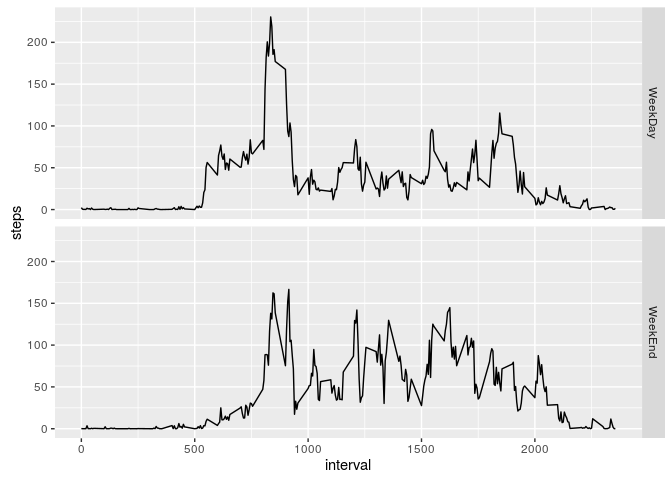

# Reproducible Research: Peer Assessment 1


## Loading and preprocessing the data

Load data and create the dataframes used along the document. The only transformation is a cast to *Date* type for column *date*: 


```r
knitr::opts_chunk$set(fig.path = "figure/") # save directory for plots

activity = read.csv("activity.csv")
activity$date <- as.Date(activity$date) # cast to Date

stepsPerDay = with(activity[!is.na(activity$steps), ], aggregate(steps, list(date), sum))
names(stepsPerDay) <- c("date", "steps.per.day")

stepsPerInterval = with(activity[!is.na(activity$steps), ], aggregate(steps, list(interval), mean))
names(stepsPerInterval) <- c("interval", "mean.steps")

meanStepsPerDay = with(activity[!is.na(activity$steps), ], aggregate(steps, list(date), mean))
names(meanStepsPerDay) <- c("date", "mean.per.day")

meanStepsPerInterval = with(activity[!is.na(activity$steps), ], aggregate(steps, list(interval), mean))
names(meanStepsPerInterval) <- c("interval", "mean.per.day")
```

**stepsPerDay** sum of all steps in the day per day. NA values are omitted

**stepsPerInterval**/**meanStepsPerInterval**: mean of steps of all days per time interval NA values are omitted

**meanStepsPerInterval**: mean of steps of all days per time interval NA values are omitted

## What is mean total number of steps taken per day?
We can calculate mean and median number of steps taken each day:

```r
# calculate median and mean
mystat <- summary(stepsPerDay$steps.per.day)
mdn <- mystat["Median"]
mn <- mystat["Mean"]
```
Mean of steps per day: **10770.00**

Median of steps per day: **10760.00**

# plot histogram of total number steps per day
Using the *stepsPerDay* defined above we can plot total number steps per day


```r
hist(stepsPerDay$steps.per.day, breaks = 20, col = "yellow", xlab = "", main = "Total number of steps taken each day (NA excluded)")
```

<!-- -->


## What is the average daily activity pattern?

We can plot the average steps per interval:


```r
with(stepsPerInterval, plot(interval, mean.steps, type = "l", xlab = "Time interval (5 min)", ylab = "Average steps per day", main = "Average steps taken per day @5 minutes intervals"))
```

<!-- -->

```r
# calculate the maximun number of steps in the interval
maxstepsidx <- which.max(stepsPerInterval$mean.steps)
maxsteps <- stepsPerInterval$mean.steps[maxstepsidx]
```
and calculate the maximun number of steps in the interval: **206.17**

## Imputing missing values
First we calculate the number of missing values (NA):

```r
# Number of rows with NA
totna <- with(activity, sum(is.na(steps)))
```
Number of rows with **NA**: 2304

Then we can impute the NA in a given interval using the mean value for that 5-minutes interval  calculate across all days. 


```r
# Create a new dataset that is equal to the original dataset but with the missing data filled in
mact <- merge(activity, meanStepsPerInterval, by = "interval")
mact[is.na(mact$steps), 2] <- mact[is.na(mact$steps), 4]
# Calculate steps per day
newStepsPerDay = aggregate(mact$steps, list(mact$date), sum)
names(newStepsPerDay) <- c("date", "steps.per.day")
# Calculate Mean and Median
mynastat <- summary(newStepsPerDay$steps.per.day)
mdnna <- mynastat["Median"]
mnna <- mynastat["Mean"]
```
Mean of steps per day (NAs imputed): **10770.00** - $Mean_{NAimputed} - Mean_{NAexcluded} =  0$

Median of steps per day (NAs imputed): **10770.00** - $Median_{NAimputed} - Median_{NAexcluded} =  10$

Finally we can plot the same histogram as above but with NA imputed

```r
# same histogram as above but with new dataset
hist(newStepsPerDay$steps.per.day, 20, col = "yellow", xlab = "", main = "Total number of steps taken each day (NA imputed)")
```

<!-- -->


With NA imputed using mean values in the 5-minutes interval across all days Median increased compared to that with NA excluded.  


## Are there differences in activity patterns between weekdays and weekends?

To check differences in activity patterns between weekdays and weekends we can create a new factor variable in the dataset with two levels weekday and weekend indicating whether a given date is a weekday or weekend day.


```r
# Set locale to "English". Only for NON English LOCALE
#loc <- Sys.setlocale("LC_ALL", "en_US.UTF-8") # Linux
loc <- Sys.setlocale("LC_ALL", "English") # Windows

# create dataset 
ac1 = mact[ , -c(4)]
ac1$wd <- weekdays(mact$date)

# prepare data for factor variable: 1 = weekday, 2 = weekend
ac1[ac1$wd %in% c("Monday", "Tuesday", "Wednesday", "Thursday", "Friday"),4] <- 1
ac1[ac1$wd %in% c("Saturday", "Sunday"),4] <- 2

# create new factor variable WeekDay/WeekEnd
ac1$wk <- factor(ac1$wd, levels = c(1,2), labels = c("WeekDay", "WeekEnd"))
```

and now we can calculate the means ad plot WeekDay vs WeekEnd


```r
# Calculate mean
myplotweek <- aggregate(steps ~ interval + wk, data=ac1, mean)
require(ggplot2)
```

```
## Loading required package: ggplot2
```

```r
qplot(interval, steps, data = myplotweek, facets = wk ~ ., geom = "line")
```

<!-- -->

